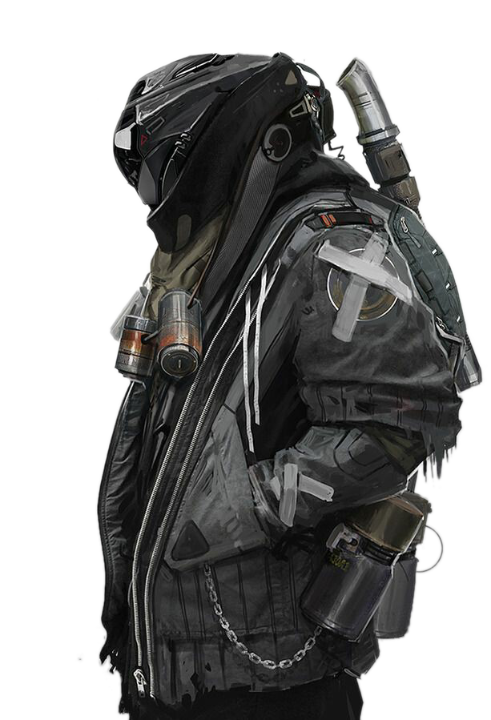

<p align="center">
  
</p>

<h1 align="center">Tactical Sci-Fi Game Landing Page</h1>

<p align="center">
  A cinematic, full-width game website built with <strong>Next.js</strong>, <strong>GSAP</strong>, <strong>Framer Motion</strong>, and <strong>Lenis</strong>.
  Dark HUD aesthetic, scroll-driven animations, combat modes, and an interactive weapons arsenal — production-ready and portfolio-grade.
</p>

<p align="center">
  <a href="#-live-demo"></a>
  <a href="#-quick-start"></a>
  
  
  
  
  
</p>

<p align="center">
  <a href="#features">Features</a> •
  <a href="#sections">Sections</a> •
  <a href="#tech-stack">Tech Stack</a> •
  <a href="#project-structure">Structure</a> •
  <a href="#animations">Animations</a> •
  <a href="#deployment">Deploy</a> •
</p>

---

## Live Demo


**[View Live Demo](https://game-landing-page-sable.vercel.app/)** — experience the full tactical landing page in your browser.

---

## Overview

This project is a **modern game landing page template** for studios, indie developers, and front-end portfolios. It delivers a **sci-fi tactical HUD** experience with:

- Full-viewport **hero section** with operative character art
- **Combat protocols** / game modes showcase
- **Weapons arsenal** with interactive cards and stat bars
- **Scroll-synced navigation** and smooth Lenis scrolling
- **GSAP + Framer Motion** micro-interactions throughout
- **Mobile-responsive** layout with reduced-motion support

Built for developers who want a **high-impact game website** without starting from scratch — ideal for FPS, tactical shooters, action RPGs, and futuristic combat titles.

---

## Features

| Feature | Description |
|--------|-------------|
| **Cinematic hero** | GSAP entrance timeline, magnetic CTA buttons, live HUD footer widgets |
| **Combat modes grid** | Featured mode cards with hover animations and intel panel |
| **Weapons showcase** | Selectable weapon cards, animated stat bars, sticky detail panel |
| **Fixed section nav** | Intersection Observer + Lenis smooth scroll to sections |
| **Motion system** | Reusable Reveal, MagneticButton, CursorGlow, MotionProvider |
| **Tactical UI** | Dark theme, red accent HUD, scanlines, grid overlays, mono telemetry fonts |
| **Performance** | Next.js App Router, optimized fonts via `next/font`, static generation |
| **Accessibility** | `prefers-reduced-motion` rules for animation-sensitive users |

---

## Sections

### 01 — Hero / Home
Full-width battlefield intro with headline, mission copy, operative image, and HUD footer (live feed, threat level, armor, weapon status).

### 02 — Combat Protocols
Three game mode cards (Strike Team featured), intel briefing panel, and loadout matrix strip.

### 03 — Arsenal Division
Four selectable weapons, sticky weapon detail panel, modular framework stats, and animated damage/range/fire-rate bars.

### 04–05 — Reserved
Navigation dots prepared for future sections (rankings, lore, download CTA, etc.).

---

## Tech Stack

| Layer | Technology |
|-------|------------|
| Framework | [Next.js 16](https://nextjs.org/) (App Router) |
| Language | [TypeScript](https://www.typescriptlang.org/) |
| UI | React 19, custom CSS (tactical HUD design system) |
| Animation | [GSAP 3](https://gsap.com/) + ScrollTrigger |
| Interaction | [Framer Motion 12](https://www.framer.com/motion/) |
| Smooth scroll | [Lenis](https://lenis.darkroom.engineering/) |
| Fonts | Orbitron, Rajdhani, Share Tech Mono via `next/font` |
| Tooling | ESLint, Tailwind CSS 4 (PostCSS) |

---

## Quick Start

### Prerequisites

- **Node.js 18+**
- **npm**, **pnpm**, **yarn**, or **bun**

### Installation

```bash
# Clone the repository
git clone https://github.com/khalidafghanmal/game-landing-page
cd game-landing-page

# Install dependencies
npm install

# Start development server
npm run dev
```

Open **[http://localhost:3000](http://localhost:3000)** to view the site.

### Production build

```bash
npm run build
npm start
```

### Lint

```bash
npm run lint
```

---

## Project Structure

```
game/
├── app/
│   ├── layout.tsx          # Fonts, metadata, MotionProvider
│   ├── page.tsx            # Page composition
│   └── globals.css         # HUD design system & motion styles
├── components/
│   ├── Header.tsx          # Sticky nav + scroll blur
│   ├── Hero.tsx            # Hero + GSAP entrance
│   ├── HudFooter.tsx       # Live HUD stat widgets
│   ├── ModesSection.tsx    # Combat protocols section
│   ├── ModeCard.tsx        # Animated mode cards
│   ├── WeaponsSection.tsx  # Arsenal showcase
│   ├── WeaponCard.tsx      # Interactive weapon cards
│   ├── SectionNav.tsx      # Dot navigation + Lenis scroll
│   ├── Overlays.tsx        # Scanlines & grid effects
│   └── motion/
│       ├── MotionProvider.tsx   # Lenis + GSAP ScrollTrigger sync
│       ├── Reveal.tsx           # Scroll reveal wrapper
│       ├── MagneticButton.tsx   # Magnetic hover buttons
│       └── CursorGlow.tsx       # Mouse-following glow
├── lib/
│   └── gsap.ts             # GSAP + ScrollTrigger registration
└── public/
    └── operative.png       # Hero character asset
```

---

## Animations

This landing page uses a **dual animation stack** for maximum impact:

### GSAP
- Hero entrance timeline on page load
- Scroll-triggered HUD stat counters
- Section parallax (grid floor, energy beams)
- Scroll reveal via `Reveal` component

### Framer Motion
- Header entrance and scroll state
- Mode card hover and stagger
- Weapon detail panel `AnimatePresence`
- Magnetic button pull effect

### Lenis
- Butter-smooth scrolling synced with GSAP ScrollTrigger
- Section navigation via programmatic `scrollTo`

All motion respects **`prefers-reduced-motion`** for accessibility.

---

## Customization

| What to change | Where |
|----------------|-------|
| Page title & meta description | `app/layout.tsx` |
| Hero headline & copy | `components/Hero.tsx` |
| Game modes | `components/ModesSection.tsx`, `ModeCard.tsx` |
| Weapons data | `components/WeaponsSection.tsx`, `WeaponCard.tsx` |
| Colors & HUD tokens | `app/globals.css` (CSS variables) |
| Hero image | Replace `public/operative.png` |
| Fonts | `app/layout.tsx` |

